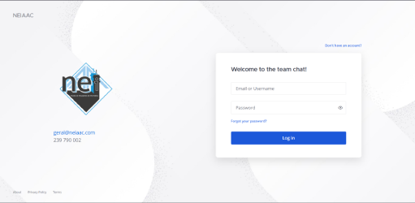
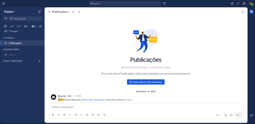
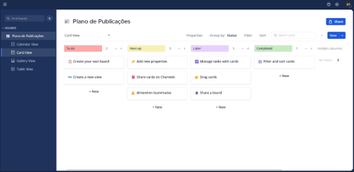

# Collaboration at scale 👔💼





This repository contains a _Docker Compose_ configuration to run a self-hosted instance of **Mattermost**, an open source collaboration platform that allows teams to communicate in real-time, share files, and integrate with other services. For people familiar with _Slack_, _Discord_, or _Microsoft Teams_, **Mattermost** is the state of the art open source alternative that can be self-hosted and customized to fit the needs of any organization.

## Requirements 📋

- Docker Compose 2.24.0+

## Usage 🚀

- Clone the repository and open a terminal **inside** it.

- Create a `.env` file based on the `.env.example` file.

- Start the docker compose:

  ```shell
  docker compose up --force-recreate
  ```

- Access Mattermost at the port you set in the `.env` file, the first user to create an account will automatically become the system administrator. This privilege and every other permission can later be assigned to other users and managed in the system console.

## Customization 🎨

In our setup we tend to use a group of plugins that are essencial to get the most out of Mattermost throughout our workflows:

- [mattermost-plugin-boards](https://github.com/mattermost/mattermost-plugin-boards) - This plugin adds a new section to Mattermost that allows users to create and manage boards, lists, and cards views of their tasks, all synced to an in-app calendar page, which essentially removes the need for project management tools external to Mattermost in the team's workflow. **See additional info at the end of this section.**

- [mattermost-plugin-playbooks](https://github.com/mattermost/mattermost-plugin-playbooks) - This plugin adds a new section to Mattermost that allows users to create and manage playbooks, which are essentially templates for recurring tasks or processes. This is useful when there are a lot of repetitive tasks or processes that need to be followed, as it allows these workflows to be standardized, ensuring that everyone is on the same page. Playbooks can be used to create checklists, assign tasks, and track progress.

- [mattermost-plugin-github](https://github.com/mattermost/mattermost-plugin-github) - This plugin adds GitHub integration to Mattermost, we use it to create a channel that keeps track and logs all activity on our repostories, like pull requests, issues, and comments.

- [mattermost-plugin-freemium](https://github.com/dy0gu/mattermost-plugin-freemium) - This plugin removes and cleans up some of the native branding the free Team Edition of the Mattermost platform has, like the _Get more features_ button and the _Upgrade to Enterprise_ banner.

All these plugins should be installed through the Mattermost system console, by upload of the bundle files ending **ONLY** in `.tar.gz`, that can be downloaded from the release page of each plugin. To update an installed plugin simply try to upload the `tar.gz` file of the new version, the system will automatically prompt you to update the existing plugin with the new version if it detects that the plugin is already installed.

The **mattermost-plugin-boards** plugin fits the special case of having a very large `tar.gz` bundle (**146MB** at time of writing), this means it usually requires some extra steps and attention to be successfully uploaded to the system console. You must ensure your reverse proxy (e.g NGINX) allows requests larger than this bundle size, and that the Mattermost `Maximum File Size` configuration is also set to a value larger than the bundle size. Additionally, if serving the platform behind a DNS service that offers proxying (e.g Cloudflare), ensure your tier allows for large file uploads, if not you will have to temporarly activate DNS only mode to upload the bundle. For example, the Free plan Cloudflare offers has a 100MB limit on file uploads with their proxy activated, which is not enough to upload the **mattermost-plugin-boards** bundle.

## Notes 📝

- To update any of the docker services simply bump the versions in the `image` fields of the `docker-compose.yaml` file and run the `docker compose up --force-recreate` command to restart them with the new version, data will be persisted through the volumes.

- Always beware of **breaking changes** when editing the version field in the `docker-compose.yaml` file! Look at the update notes of each component to see if there are any migration steps required when upgrading, Mattermost usually mentions any required steps in their [upgrade notes](https://docs.mattermost.com/upgrade/important-upgrade-notes.html) page.
